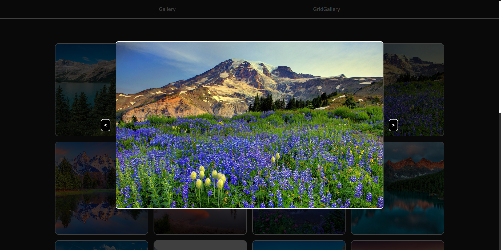

# Gallery 🖼️

### **Start app**

1. _Fork or download the app and open the folder in the cli_
2. _Install all dependencies using the `yarn` command_
3. _Add dependence using the `yarn add sharp --ignore-engines -D` command_
4. _Build the project using the `yarn build` command_
5. _Start the web server using the `yarn preview` command. The app will be served at http://localhost:4173/._

---

 

<b>Screenshots</b>
    
  
<h3>Gallery</h3>

<h3>Image</h3>

<h3>Grid Gallery</h3>

---

### **Technology stack:**

- _Vite_
- _React_
- _SCSS_
- _React-router-dom_
- _vite-plugin-image-optimizer_
